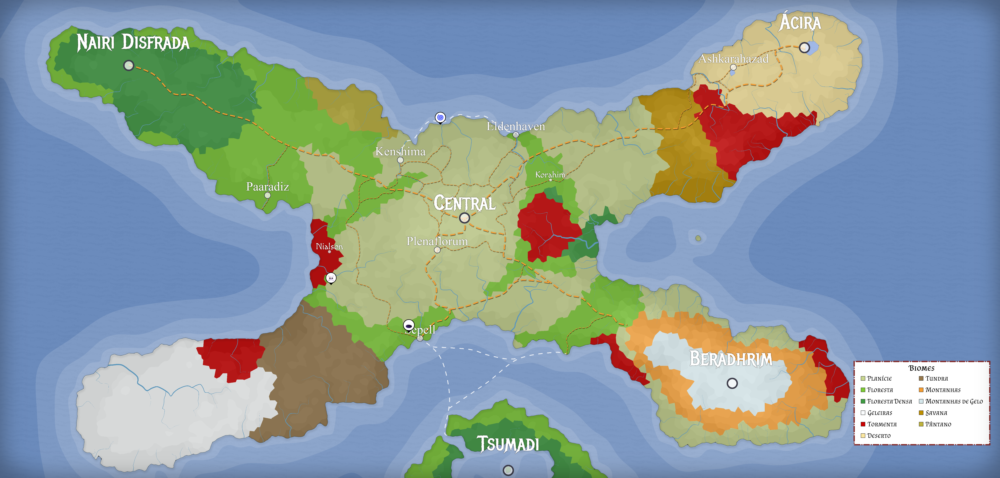
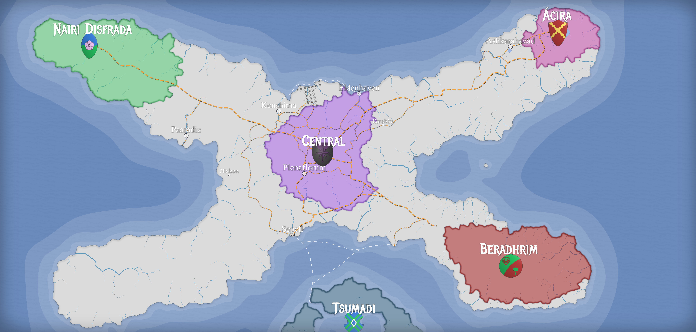

---
tags:
  - continente
---
Essa documentação é onde eu, [Nii Miyo](https://github.com/NiiMiyo), organizo minhas anotações sobre o mundo do meu RPG, Nyrule, mestrado no sistema de [Tormenta 20](https://site.jamboeditora.com.br/tormenta20/). Conforme o jogo vai se desenrolando e eu vou preparando mais coisas a documentação aqui vai aumentando.

## **Aviso para os jogadores**
Eu uso esse site pra organizar completamente tudo sobre o RPG, então se você joga o RPG comigo **NÃO entre nas outras páginas**. Elas podem ter muitos spoilers de coisas que preparei. **Essa página é a única que nunca vai ter spoiler**.

## O Mundo de Nyrule
Nyrule é um mundo de alta fantasia medieval, repleto de magia, arcanistas, guerreiros, fadas, monstros e muito mais. É inspirado em Arton, o cenário oficial de [Tormenta 20](https://site.jamboeditora.com.br/tormenta20/), mas com sua própria história e origem.

Conforme a história avança o mapa também vai se modificando.

### Geo-Política
No centro de Nyrule temos [Ampáfica](./Lugares/Nyrule/Amp%C3%A1fica/Amp%C3%A1fica.md), um reino de humanos fundado há séculos atrás pela família Semore. Sua capital, a [Central](./Lugares/Nyrule/Amp%C3%A1fica/Central/Central.md), é a maior cidade do continente.

Ao noroeste temos a Floresta do Elfo, com a capital sendo Nairi Disfrada. Como o nome implica, sua população é majoritariamente élfica, mas também possuem outras raças em menor quantidade, como dahllans e moreaus. Eles são bem cuidadosos com estranhos, mas confiam em amigos mesmo que de raças diferentes.

Ao sudoeste temos os Grandes Espinhos, uma enorme cadeia de montanhas. Dentro dessas montanhas está Beradhrim, um sistema de túneis e cavernas criado pelos anões.

Ao nordeste temos _\[Lugar que ainda não nomeei\]_, um enorme deserto. No centro desse deserto está Ácira, uma cidade de minotauros e goblins ao redor de um enorme oásis.