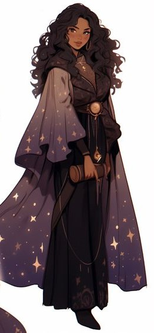

---
tags:
  - pc
title: Amna
---
Uma qareen inventora vinda da cidade de Ashkarahazad, próxima de Ácira.

Nascida uma meio-humana-dahllan, cresceu em um cenário complicado em que ambos seus pais queriam que ela assumisse seu lado para governar a sua cidade. Enquanto crescia foi perdendo o amor de seus pais por ser apenas uma humana sem atributos especiais ou capacidade de liderança, o que levou à alta cobiça de posições elevadas nos povoados próximos e à um grande teste de sobrevivência para testar as capacitações dos escolhidos.

Um dos motivos que fez Amna estar sempre desinteressada nas expectativas de seus pais foi sua grande paixão. Azazel e Amna, que se apresentou como Ynnd pois acreditava ser perigoso se mostrasse quem realmente é, se casaram e foram felizes, pelo menos pelo pouco tempo que tiveram.

Amna, que falhou em todos os testes, teve de se aventurar e sobreviver ao _Deserto Sem Retorno_{title="Escolher um nome de verdade pra isso"} por sua conta e risco e, caso adquirisse a força necessária, poderia retornar para governar o povo que escolher.

Azazel e Amna tiveram de partir para o _Deserto Sem Retorno_ sem Azazel sequer saber sobre o teste de resistência, mas pouco antes de se mudarem, Azazel trapaceou num jogo de cartas contra um general humano, que os perseguiu até o deserto. Ao fim, foram mortos ambos pela equipe do general.

Amna, em seus últimos momentos de vida, suplica para que qualquer divindade que possa ouvi-la que a salve. Seu pedido foi ouvido. Dias após de sua morte, Wynna a desperta como qareen, fazendo que esqueça sua origem humana e se torne filha da própria Deusa da Magia. Foi o suficiente para que Amna deixasse o deserto sozinha e agora apenas seu destino lhe restava.

A equipe de um qareen inventor que passava pelo deserto encontrou a qareen e a resgatou, levando-a para uma cidade próxima.

Ela deve recuperar suas memórias para entender sua essência e se desenvolver completamente, mas terá que fazer uma escolha difícil em relação ao seu passado.

## Galeria

